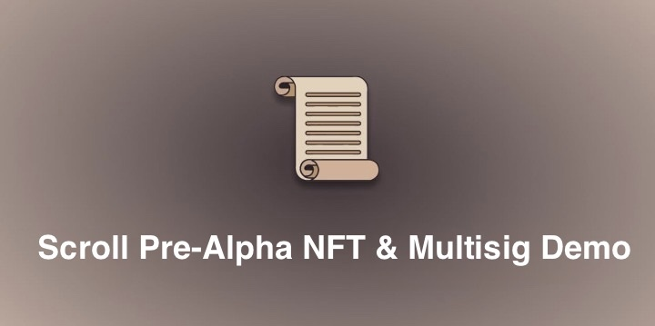

# Scroll NFT and Multisig deployment Demo

**This project is part of the more detailed blog post you can find [here](https://0xpajic.com/blog/scroll-layer2-nft-and-multisig-deployment/)**  

## What's the repo about?

It demonstrates a few things:
1. Scroll is **EVM Equivalent**, allowing us to use a bit more _"niche"_ tools at moment of writing this
2. Create Multisig contract in [Vyper](https://vyper.readthedocs.io/en/stable/) using [Supersig](https://github.com/dmfxyz/supersig)
3. Create NFT contract in Solidity using [OpenZeppelin libraries](https://github.com/OpenZeppelin/openzeppelin-contracts/)
4. Use Brownie to:
   - Deploy above contracts 
   - Test above contracts

If you aren't too keen on experimenting and would rather try out **Scroll** 
in [Hardhat](https://hardhat.org/) and [Solidity](https://docs.soliditylang.org/en/v0.8.17/), checkout the official guide [here](https://guide.scroll.io/user-guide/contract-deployment-tutorial).

## Where are the final contracts deployed?

The contracts are deployed on [Scroll's](https://scroll.io/) Alpha testnet you can read more about [here](https://scroll.io/alpha).

**TheNFT.sol:** [0x2b755B2D78156215Ac9dA3b2E09eB674B1493C92](https://blockscout.scroll.io/address/0x2b755B2D78156215Ac9dA3b2E09eB674B1493C92)  
**Supersig.vy:** [0x6fD91afc1C7dCB72387da9a4A6B3108C6538CF85](https://blockscout.scroll.io/address/0x6fD91afc1C7dCB72387da9a4A6B3108C6538CF85)

## What do I need to have before I start?
To run the project, you need:
- Python 3.8 local development environment
- Node.js 16 to run Ganache-cli
- `brownie-eth` 1.19 installed. Guide [here](https://eth-brownie.readthedocs.io/en/stable/install.html)
- `ganache-cli` 6.12 installed. And yes, don't use the newer `ganache` package since it has incompatibilities with brownie
- Scroll network setup in your Brownie `network-config.yaml` file. Here's a short guide [here](https://github.com/pajicf/scroll-multisig-and-nft/blob/main/assets/network_config_guide.MD)
- Good will 🙂

## How do I run this project?
1. `git clone https://github.com/pajicf/scroll-multisig-and-nft`  
2. `cd scroll-multisig-and-nft`  
3. `brownie test` - To run the tests
4. `brownie compile` - To compile and build the smart contracts
5. `brownie run ./scripts/deploy.py --network scroll-alpha` - To deploy the contracts  
_!In the next steps don't forget to replace values with your own!_
6. `brownie run ./scripts/transfer_ownership.py main [NFT_ADDRESS] [MULTISIG_ADDRESS] --network scroll-alpha` - To transfer NFT ownership to the multisig
7. `brownie run ./scripts/multisig_script.py main [NFT_ADDRESS] [MULTISIG_ADDRESS] --network scroll-alpha` - To mint the NFT through the multisig
